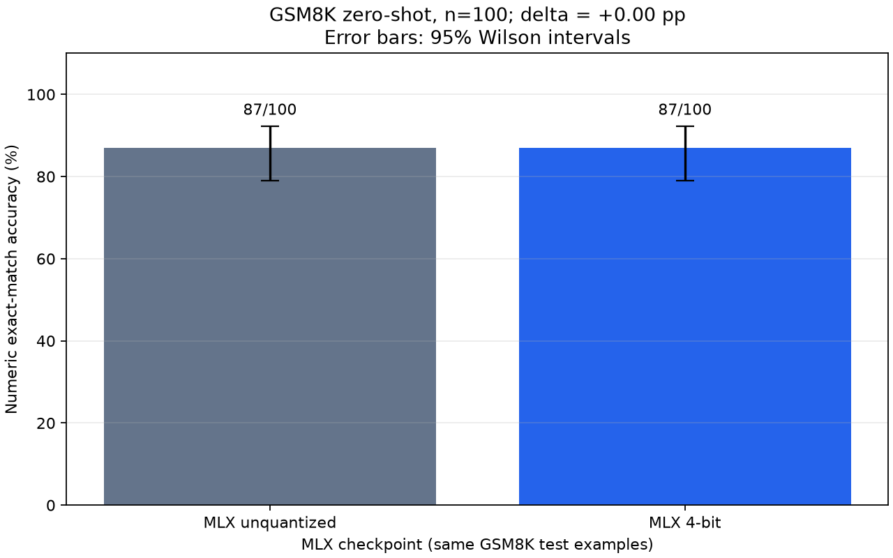

# GSM8K accuracy comparison

| Variant | Correct / total | Accuracy | 95% Wilson CI | Invalid answers |
| --- | ---: | ---: | ---: | ---: |
| MLX unquantized | 87/100 | 87.00% | 79.02%–92.24% | 7 |
| MLX 4-bit | 87/100 | 87.00% | 79.02%–92.24% | 4 |

Quantized minus baseline: **+0.00 percentage points**; paired bootstrap 95% interval: [-7.00, +7.00] pp.
Regressions: 7; improvements: 7.

Dataset revision, sample IDs, settings, checkpoint configs, versions, and raw answers are in [accuracy_results.json](accuracy_results.json).

This is a small, zero-shot math evaluation, not a general quality or vision benchmark. Missing, malformed, or incorrect final answers score zero. Test-set contamination in pretraining is unknown. A tied score (including a degenerate paired bootstrap interval) does not prove parity. Do not compare this protocol directly to leaderboard scores or transfer MLX scores to GGUF/Ollama.
