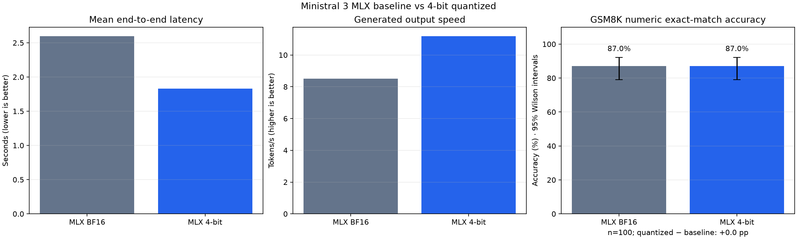

# Historical M4 smoke benchmark results

This report records the reproducible smoke benchmark for the converted
checkpoint. It is a functional regression check, not a general accuracy
benchmark.

## Environment

- Hardware: Apple Mac mini M4, 16 GB unified memory
- OS: macOS 26.4
- Python: 3.13
- `mlx`: 0.32.2
- `mlx-vlm`: 0.7.1
- `mlx-lm`: 0.31.3
- Quantization: 4-bit affine, group size 64
- Sampler: default greedy sampler
- Maximum generation length: 96 tokens

## Command

```bash
python benchmark_mlx.py \
  --model artifacts/Ministral-3-3B-Instruct-2512-4bit \
  --max-tokens 96
```

## Functional checks

| Case | Expected check | Result |
| --- | --- | --- |
| Arithmetic: `17 × 6` | `102` | PASS |
| Science: why ice floats | `less dense` | PASS |
| Italian capital | `roma` | PASS |
| JSON instruction | `status` and `ok` | PASS |
| **Summary** | 4 fixed keyword checks | **4/4 passed** |

Observed outputs included `102`, an explanation that ice is less dense when
frozen, `Roma`, and a JSON object containing `status: ok`.

## Runtime measurements

The separate single-prompt runtime smoke test measured approximately:

| Measurement | Result |
| --- | ---: |
| Converted artifact size | 2.6 GiB |
| Prompt processing | 522.1 tokens/s |
| Generation | 46.9 tokens/s |
| Peak memory reported by MLX | 2.458 GiB |

Token-per-second and memory values vary with hardware, OS, runtime versions,
prompt length, and cache state. The functional checks are intentionally small
and do not establish factuality, safety, or BF16 quality parity.

## Measured paired evaluation — 2026-09-21

The current comparison was run on **Apple M1 Pro, 16 GB**, macOS 26.6.2,
Python 3.13.7. It is separate from the historical M4 measurements above.
Both models use greedy decoding and `fix_mistral_regex=True`.

| Metric | MLX BF16 | MLX 4-bit |
| --- | ---: | ---: |
| Mean inference latency, four smoke prompts | 2.60 s | 1.83 s |
| Mean output speed, four smoke prompts | 8.51 tok/s | 11.19 tok/s |
| GSM8K numeric exact match, 100 test examples | 87/100 (87%) | 87/100 (87%) |
| 95% Wilson accuracy interval | 79.02%–92.24% | 79.02%–92.24% |
| Invalid final answers (scored incorrect) | 7 | 4 |

Quantized minus baseline: **0.0 pp**, with paired bootstrap 95% interval
**[−7.0, +7.0] pp** (2,000 resamples). Seven examples regressed and seven
improved; equal totals do not prove general quality parity.

Accuracy uses the pinned GSM8K test split, 100 random examples (seed 42), the
same zero-shot prompt, 512 maximum generated tokens, and normalized numeric
exact match. Runtime uses four distinct smoke prompts and 96 maximum tokens.
The test labels were never included in prompts or used to tune the models.



See the [method and reproduction commands](README.md#accuracy-source-precision-versus-quantized),
[raw accuracy results and provenance](benchmark_artifacts/accuracy/accuracy_results.json),
[accuracy report](benchmark_artifacts/accuracy/accuracy_results.md), and
[current runtime results](benchmark_artifacts/benchmark_results.json).
The previous M4 comparison is preserved in
[historical_m4](benchmark_artifacts/historical_m4/benchmark_results.json).
Downloaded/converted weights are removed after evaluation; reports are retained.
